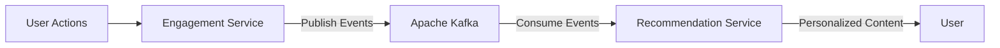

<div align="center">

# 👋 Olá, eu sou Lucas Eckert

### Desenvolvedor Backend Java | Aprendiz em análise e desenvolvimento de sistemas

<p align="center">
  <a href="mailto:lucasismaeleckert@gmail.com"></a>
  <a href="https://github.com/Luca5Eckert"></a>
  <a href="https://www.linkedin.com/in/lucas-ismael-eckert-92a7bb399"></a>
  <a href="https://drive.google.com/file/d/1qSHzO_hmeVhd22_qKNw1DO-nmNazvqA6/view?usp=sharing"></a>
</p>

<p>
💻 Apaixonado por desenvolvimento backend e arquitetura de software<br>
🎯 Focado em Java, Spring Boot e boas práticas de código<br>
📚 Estudando princípios SOLID e Clean Architecture
</p>

</div>

---

## 🚀 Projetos em Destaque

<details open>
<summary><h3>📚 <a href="https://github.com/Luca5Eckert/SyncoApi">SyncoApi</a> — API REST para Gestão Acadêmica</h3></summary>

> Plataforma backend focada em fortalecer a comunicação e centralizar dados em ambientes de aprendizagem. Atua como um ponto central de informação (*Single Source of Truth*) para coordenadores, professores e alunos.

<table>
  <tr>
    <td><strong>🛠️ Stack</strong></td>
    <td>Java 21, Spring Boot 3.3, Spring Security, Spring Data JPA, MySQL, H2, JWT</td>
  </tr>
  <tr>
    <td><strong>🏗️ Arquitetura</strong></td>
    <td>Clean Architecture com Repository Pattern, Use Cases e Value Objects</td>
  </tr>
  <tr>
    <td><strong>📊 Status</strong></td>
    <td></td>
  </tr>
</table>

**🔑 Funcionalidades Principais:**
- 🔐 Autenticação e autorização com JWT (24h expiry)
- 👥 CRUD completo de usuários com roles (USER/ADMIN)
- 📚 Gerenciamento de cursos
- 📋 Gestão de faltas e feedback de ambiente (planejado)
- 📢 Mural de avisos oficiais (planejado)

<details>
<summary><strong>📡 Endpoints da API</strong></summary>

| Método | Endpoint | Descrição | Auth |
|:------:|----------|-----------|:----:|
| `POST` | `/api/auth/register` | Registrar novo usuário | ❌ |
| `POST` | `/api/auth/login` | Autenticar usuário | ❌ |
| `PATCH` | `/api/auth/password` | Alterar senha | ✅ |
| `GET` | `/api/users` | Listar usuários | ✅ |
| `GET` | `/api/users/{id}` | Buscar usuário por ID | ✅ |
| `POST` | `/api/users` | Criar usuário | 🔒 ADMIN |
| `GET` | `/api/courses` | Listar cursos | ✅ |
| `POST` | `/api/courses` | Criar curso | 🔒 ADMIN |

</details>

</details>

<details open>
<summary><h3>🎬 <a href="https://github.com/Luca5Eckert/media-recommendation-system">Media Recommendation System</a> — Plataforma Event-Driven</h3></summary>

> Sistema de recomendação de mídia inspirado em Netflix e Spotify, construído com arquitetura de microsserviços e comunicação assíncrona via Apache Kafka.

<table>
  <tr>
    <td><strong>🛠️ Stack</strong></td>
    <td>Java 21, Spring Boot 4.0, PostgreSQL 15, Apache Kafka 7.3, Docker</td>
  </tr>
  <tr>
    <td><strong>🏗️ Arquitetura</strong></td>
    <td>Microsserviços com Event-Driven Architecture e Database per Service</td>
  </tr>
  <tr>
    <td><strong>📊 Status</strong></td>
    <td></td>
  </tr>
</table>

**🧩 Microsserviços:**

| Serviço | Responsabilidade | Banco de Dados |
|---------|------------------|----------------|
| 🔐 **User Service** | Autenticação, perfis e preferências | `user_db` |
| 📚 **Catalog Service** | Catálogo de filmes e séries | `catalog_db` |
| 💡 **Engagement Service** | Tracking de interações (views, likes, ratings) → Kafka | `engagement_db` |
| 🎯 **Recommendation Service** | Consume eventos Kafka → ML algorithms | `recommendation_db` |



</details>

<details open>
<summary><h3>📝 <a href="https://github.com/Luca5Eckert/textsense-api-java">TextSense API</a> — Análise de Texto com NLP</h3></summary>

> API stateless e leve para análise de texto em tempo real, utilizando Stanford CoreNLP para processamento de linguagem natural.

<table>
  <tr>
    <td><strong>🛠️ Stack</strong></td>
    <td>Java 21, Spring Boot 3, Stanford CoreNLP, Maven</td>
  </tr>
  <tr>
    <td><strong>🏗️ Arquitetura</strong></td>
    <td>Stateless REST API (sem banco de dados)</td>
  </tr>
  <tr>
    <td><strong>📊 Status</strong></td>
    <td></td>
  </tr>
</table>

**🔍 Funcionalidades:**
- 📊 **Text Statistics**: Contagem de palavras, caracteres, sentenças e tempo de leitura
- 💭 **Sentiment Analysis**: Análise de sentimento com score (0-4) e label

<details>
<summary><strong>📡 Contrato da API</strong></summary>

**Endpoint:** `POST /analyze`

```json
// Request
{
  "text": "This new framework is absolutely brilliant!"
}

// Response
{
  "statistics": {
    "characterCount": 45,
    "wordCount": 6,
    "sentenceCount": 1,
    "readingTimeSeconds": 2
  },
  "sentiment": {
    "score": 3,
    "label": "POSITIVE"
  }
}
```

| Score | Label |
|:-----:|-------|
| 0 | VERY_NEGATIVE |
| 1 | NEGATIVE |
| 2 | NEUTRAL |
| 3 | POSITIVE |
| 4 | VERY_POSITIVE |

</details>

</details>

<details>
<summary><h3>💡 <a href="https://github.com/Luca5Eckert/AlgorithmsAndLeetCodeQuestions">AlgorithmsAndLeetCode</a> — Algoritmos e Estruturas de Dados</h3></summary>

> Soluções de problemas do LeetCode e implementações de algoritmos clássicos para aprimoramento de lógica de programação.

<table>
  <tr>
    <td><strong>🛠️ Stack</strong></td>
    <td>Java</td>
  </tr>
  <tr>
    <td><strong>🎯 Foco</strong></td>
    <td>Arrays, Linked Lists, Trees, Graphs, Dynamic Programming, Sorting</td>
  </tr>
</table>

</details>

---

## 🛠️ Tecnologias & Ferramentas

<div align="center">

### Backend Development


### Frontend & Web


### Tools & DevOps


</div>

---

## 💼 Foco Atual

```yaml
🎯 Projeto Principal: Media Recommendation System - plataforma event-driven com Kafka e Docker
📚 Estudando: Clean Architecture, Domain-Driven Design e arquitetura orientada a eventos
🔨 Praticando: Princípios SOLID, Design Patterns e consumo/produção de mensagens Kafka
🌱 Aprendendo: Mensageira, Event Driven Design fundamentos de DSA
```

---

## 📈 Estatísticas GitHub

<div align="center">


<br><br>


<br><br>

<picture>
  <source media="(prefers-color-scheme: dark)" srcset="https://raw.githubusercontent.com/Luca5Eckert/Luca5Eckert/output/github-snake-dark.svg" />
  <source media="(prefers-color-scheme: light)" srcset="https://raw.githubusercontent.com/Luca5Eckert/Luca5Eckert/output/github-snake.svg" />
  
</picture>

</div>

---

<div align="center">

### 📫 Entre em Contato

[](mailto:lucasismaeleckert@gmail.com)
[](https://github.com/Luca5Eckert)
[](https://www.linkedin.com/in/lucas-ismael-eckert-92a7bb399)

<br>

> *"Código limpo não é escrito seguindo regras. É escrito com amor."* - Robert C. Martin

<br>


</div>
