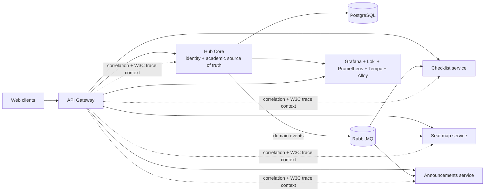

# Portal Conecta — backend case study

Portal Conecta is a modular academic platform developed as a team project in the WEG/CentroWEG-SENAI Systems Development Apprenticeship Program.

This case study separates three things that are easy to blur in a portfolio:

1. the platform's team result;
2. the backend scope where I acted as a technical reference;
3. the initiatives that can be attributed directly to my merged pull requests.

## Situation

Multiple feature teams needed shared users, courses, classes, rooms, permissions, authentication context, and integration contracts.

If each feature module stored its own version of that data, the platform would accumulate:

- duplicated identity and academic rules;
- inconsistent authorization;
- incompatible payload assumptions;
- repeated logging and tracing code;
- hidden coupling between teams.

## Task

The central backend needed to act as the source of truth for shared academic state while allowing feature modules to remain independently owned.

My work was concentrated on:

- Hub Core boundaries and lifecycle rules;
- API and event contracts;
- administrative backend workflows;
- gateway and request-context behavior;
- reusable logging;
- observability and trace propagation.

I do not claim individual ownership of every Portal Conecta module or of the complete 682-test suite.

## Architectural boundary

The Hub Core owns shared identity and academic data. Feature services integrate through HTTP contracts and RabbitMQ events instead of duplicating the core model.

## Individually attributable initiative: administrative imports

### Problem

Creating users and classes one at a time was inadequate for administrative onboarding. A bulk import could not bypass the rules already enforced by manual creation flows.

### Decision

Implement spreadsheet imports as orchestration around existing use cases rather than creating a parallel persistence path.

That preserved:

- permission checks;
- duplicate validation;
- activation behavior;
- domain-event publication;
- transaction boundaries.

### User import

[PR #293 — importar usuários por planilha](https://github.com/Portal-Conecta/core-backend/pull/293)

Implemented:

- `POST /imports/users`;
- CSV and XLSX input;
- `dryRun` validation without persistence, token, or notification;
- `REJECT` and `SKIP` conflict policies;
- user type inference from approved email domains;
- protection against importing privileged account types;
- per-row result reporting without exposing emails, tokens, passwords, or hashes;
- reuse of `CreateUserUseCase` so activation is still emitted after commit.

The merged PR contains 669 additions across 11 files and was authored by Lucas Eckert.

### Class import

[PR #296 — importar turmas por planilha](https://github.com/Portal-Conecta/core-backend/pull/296)

Implemented:

- `POST /imports/classes`;
- CSV and XLSX input;
- course resolution by stable `course_code` rather than requiring administrators to know UUIDs;
- localized shift values mapped to domain values;
- `dryRun` and `REJECT`/`SKIP` behavior;
- reusable CSV template endpoint;
- parser, use-case, controller, and repository coverage;
- delegation to `CreateClassUseCase`, preserving permissions, duplicate rules, and events.

The merged PR contains 756 additions and 1 deletion across 12 files and was authored by Lucas Eckert.

## Platform concerns

### API Gateway

The gateway acts as the external ingress boundary for:

- routing;
- JWT policy;
- rate limiting;
- error shaping;
- correlation IDs;
- W3C Trace Context propagation.

Downstream services still apply their own authorization rules; the gateway is not treated as the only trust boundary.

### Reusable logging

The `portal-logging` package centralizes servlet/reactive access logging, request correlation, user-id resolution, health/metrics suppression, and service auto-configuration.

The value is not merely fewer log statements. It gives services a consistent request identity and log shape, making cross-service investigation possible.

### Observability

The local platform includes:

- Prometheus metrics;
- Grafana dashboards;
- Loki logs;
- Tempo traces;
- Alloy collection;
- JVM and HTTP operational views.

The objective is failure visibility: a request should be traceable from gateway ingress through backend work without each team inventing a different telemetry convention.

## Result

The platform can integrate feature teams through:

- one shared identity and academic-data backend;
- explicit HTTP and RabbitMQ contracts;
- one gateway boundary;
- reusable request logging;
- a common observability stack.

A Hub Core release validation recorded **682 Maven tests with 0 failures and 0 errors**. This is a team-system result and is presented as release evidence, not as an individual test count.

## Trade-offs

| Decision | Benefit | Cost |
|---|---|---|
| Central Hub Core | Consistent identity, academic state, and authorization | Requires disciplined boundaries to avoid becoming a feature monolith |
| Existing-use-case reuse in imports | Preserves rules and events | Bulk processing inherits synchronous case-use cost and may need an asynchronous path for very large files |
| HTTP plus RabbitMQ integration | Supports request/response and asynchronous propagation | Requires contract versioning, retry behavior, and observability across both styles |
| Shared logging package | Consistent correlation and access logs | Package changes affect multiple services and need compatibility discipline |
| Gateway plus downstream security | Defense in depth | Duplicates some token validation work and configuration |

## What I would improve next

- retain dated CI artifacts for release-level metrics;
- add import size limits and an asynchronous bulk-processing path;
- add idempotency and retry policies for cross-service events;
- formalize compatibility tests for API and event contracts;
- add service-level objectives and alert thresholds based on observed behavior;
- publish sanitized ADRs for core boundaries, account lifecycle, and observability.

## Evidence links

- [Portal Conecta organization](https://github.com/Portal-Conecta)
- [User import PR #293](https://github.com/Portal-Conecta/core-backend/pull/293)
- [Class import PR #296](https://github.com/Portal-Conecta/core-backend/pull/296)
- [Core backend](https://github.com/Portal-Conecta/core-backend)
- [API Gateway](https://github.com/Portal-Conecta/api-gateway)
- [Reusable logging](https://github.com/Portal-Conecta/portal-logging)
- [Observability](https://github.com/Portal-Conecta/observability)
